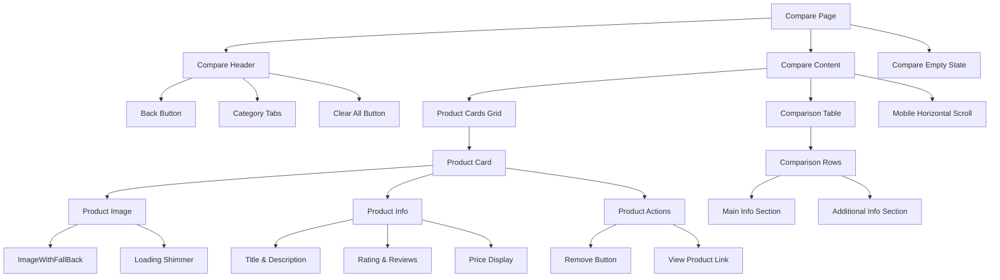
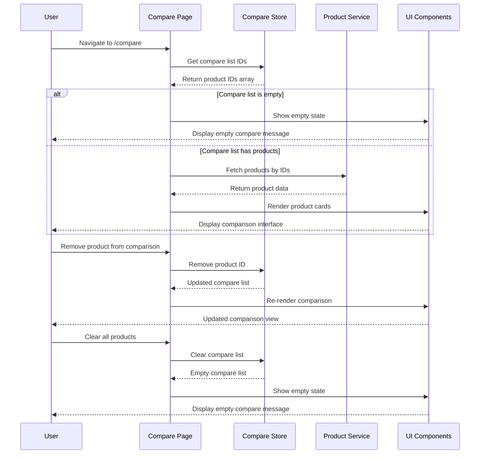
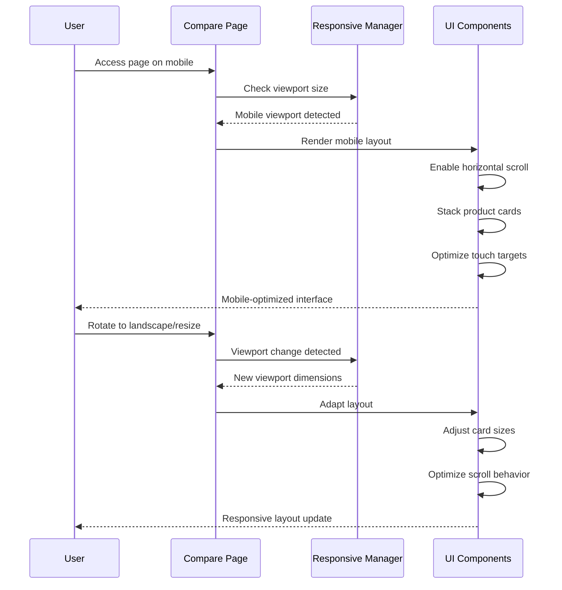

# Design Document: Compare Page Redesign

## Overview

The compare page redesign aims to modernize the product comparison experience by implementing contemporary design patterns, improving mobile responsiveness, and ensuring consistency with the existing UI variations (UI-2, UI-3, UI-4). The current implementation suffers from outdated styling, poor image handling using basic Image components instead of ImageWithFallBack, and lacks the modern card-based layouts found in other product pages.

This redesign will transform the compare page into a responsive, touch-friendly interface that maintains visual consistency with the rest of the application while providing an enhanced user experience across all device sizes. The new design will incorporate proper image fallback handling, modern loading states, empty states, and improved visual hierarchy for better product comparison.

## Architecture

The redesigned compare page will follow a modular component architecture that aligns with the existing UI variation patterns in the system.



## Sequence Diagrams

### Product Comparison Flow



### Responsive Layout Adaptation



## Components and Interfaces

### ComparePageContainer

**Purpose**: Main container component that orchestrates the entire compare page experience

**Interface**:
```typescript
interface ComparePageContainerProps {
  initialData?: ProductFull[][];
  className?: string;
}

interface ComparePageState {
  selectedCategoryIndex: number;
  isLoading: boolean;
  error: string | null;
  viewMode: 'grid' | 'table';
}
```

**Responsibilities**:
- Manage compare list state and data fetching
- Handle category switching and filtering
- Coordinate responsive layout changes
- Manage loading and error states

### ModernProductCard

**Purpose**: Enhanced product card component with modern design patterns

**Interface**:
```typescript
interface ModernProductCardProps {
  product: ProductFull;
  variant: 'ui-2' | 'ui-3' | 'ui-4';
  onRemove: (productId: number) => void;
  onViewProduct: (productUuid: string) => void;
  className?: string;
  isCompact?: boolean;
}

interface ProductCardActions {
  remove: () => void;
  viewDetails: () => void;
  addToCart?: () => void;
  toggleLike?: () => void;
}
```

**Responsibilities**:
- Display product information with modern card styling
- Handle image loading with ImageWithFallBack
- Provide consistent action buttons across UI variations
- Support responsive design patterns

### ComparisonTable

**Purpose**: Structured comparison table for detailed product analysis

**Interface**:
```typescript
interface ComparisonTableProps {
  products: ProductFull[];
  variant: 'ui-2' | 'ui-3' | 'ui-4';
  onProductRemove: (productId: number) => void;
  className?: string;
}

interface ComparisonRow {
  label: string;
  values: Record<number, React.ReactNode>;
  category: 'basic' | 'specs' | 'extras';
  isExpandable?: boolean;
}
```

**Responsibilities**:
- Organize product data into comparable rows
- Support expandable sections for detailed specifications
- Maintain consistent styling across UI variations
- Handle empty data states gracefully

### ResponsiveCompareLayout

**Purpose**: Adaptive layout manager for different screen sizes

**Interface**:
```typescript
interface ResponsiveCompareLayoutProps {
  children: React.ReactNode;
  products: ProductFull[];
  viewMode: 'grid' | 'table';
  onViewModeChange: (mode: 'grid' | 'table') => void;
}

interface LayoutBreakpoints {
  mobile: number;
  tablet: number;
  desktop: number;
  wide: number;
}
```

**Responsibilities**:
- Detect viewport changes and adapt layout
- Manage horizontal scrolling on mobile devices
- Switch between grid and table views
- Optimize touch interactions for mobile

### CompareEmptyState

**Purpose**: Enhanced empty state with modern design and clear call-to-action

**Interface**:
```typescript
interface CompareEmptyStateProps {
  onBrowseProducts: () => void;
  className?: string;
  variant: 'ui-2' | 'ui-3' | 'ui-4';
}
```

**Responsibilities**:
- Display engaging empty state illustration
- Provide clear navigation to product browsing
- Match design system styling
- Support different UI variations

## Data Models

### Enhanced Product Comparison Data

```typescript
interface CompareProductData extends ProductFull {
  comparisonMetadata: {
    addedAt: Date;
    category: Category;
    primaryImage: string;
    fallbackImage: string;
    comparisonScore?: number;
  };
}

interface ComparisonGroup {
  categoryId: number;
  categoryName: string;
  products: CompareProductData[];
  commonSpecs: string[];
  differentiatingSpecs: string[];
}

interface ComparisonState {
  groups: ComparisonGroup[];
  selectedGroupIndex: number;
  viewMode: 'grid' | 'table';
  sortBy: 'price' | 'rating' | 'name' | 'added';
  sortOrder: 'asc' | 'desc';
}
```

**Validation Rules**:
- Maximum 4 products per comparison group
- Products must belong to the same category for meaningful comparison
- Each product must have valid image URL or fallback
- Comparison metadata must include valid timestamps

### UI Variation Configuration

```typescript
interface UIVariationConfig {
  variant: 'ui-2' | 'ui-3' | 'ui-4';
  cardStyle: {
    borderRadius: string;
    padding: string;
    shadow: string;
    hoverEffect: string;
  };
  colorScheme: {
    primary: string;
    secondary: string;
    accent: string;
    background: string;
  };
  typography: {
    titleSize: string;
    bodySize: string;
    priceSize: string;
  };
}

interface ResponsiveConfig {
  breakpoints: LayoutBreakpoints;
  cardSizes: {
    mobile: { width: string; height: string };
    tablet: { width: string; height: string };
    desktop: { width: string; height: string };
  };
  scrollBehavior: {
    mobile: 'horizontal' | 'vertical';
    tablet: 'grid' | 'table';
    desktop: 'grid' | 'table';
  };
}
```

**Validation Rules**:
- UI variant must be one of the supported types
- Color values must be valid CSS color formats
- Breakpoint values must be positive integers
- Card dimensions must be valid CSS size values

## Error Handling

### Image Loading Failures

**Condition**: Product images fail to load due to network issues or invalid URLs
**Response**: ImageWithFallBack component automatically displays fallback image with loading shimmer
**Recovery**: Retry mechanism attempts to reload failed images after network recovery

### API Request Failures

**Condition**: Product comparison API requests fail due to server errors or network issues
**Response**: Display error state with retry button and clear error message
**Recovery**: Implement exponential backoff retry strategy with manual retry option

### Empty Compare List

**Condition**: User accesses compare page with no products in comparison list
**Response**: Show engaging empty state with illustration and call-to-action
**Recovery**: Provide direct navigation to product browsing pages

### Category Mismatch

**Condition**: Products from different categories are compared together
**Response**: Group products by category and show category tabs for switching
**Recovery**: Allow users to remove mismatched products or compare within categories

### Mobile Performance Issues

**Condition**: Large number of products causes performance issues on mobile devices
**Response**: Implement virtual scrolling and lazy loading for product cards
**Recovery**: Progressive loading with skeleton states and performance monitoring

## Testing Strategy

### Unit Testing Approach

Focus on testing individual components in isolation with comprehensive coverage of props, state changes, and user interactions. Key areas include:

- **Component Rendering**: Verify all components render correctly with various prop combinations
- **State Management**: Test compare store operations (add, remove, clear) with edge cases
- **Image Handling**: Validate ImageWithFallBack behavior with valid/invalid URLs
- **Responsive Behavior**: Test layout adaptations across different viewport sizes
- **Error Boundaries**: Ensure graceful error handling and recovery mechanisms

**Testing Tools**: Jest, React Testing Library, MSW for API mocking

### Property-Based Testing Approach

Implement property-based tests to validate system behavior across a wide range of inputs and scenarios.

**Property Test Library**: fast-check (for TypeScript/JavaScript)

**Key Properties to Test**:

1. **Compare List Consistency**: For any sequence of add/remove operations, the compare list should maintain data integrity
2. **Image Fallback Reliability**: For any image URL (valid or invalid), the ImageWithFallBack component should always render something
3. **Responsive Layout Stability**: For any viewport size, the layout should remain functional and accessible
4. **Category Grouping Correctness**: Products should always be grouped correctly by category regardless of addition order
5. **Performance Bounds**: Page rendering time should remain within acceptable limits regardless of product count

**Example Property Test**:
```typescript
// Property: Compare list operations maintain consistency
fc.assert(fc.property(
  fc.array(fc.record({
    action: fc.constantFrom('add', 'remove'),
    productId: fc.integer(1, 1000)
  })),
  (operations) => {
    const store = createCompareStore();
    operations.forEach(op => {
      if (op.action === 'add') {
        store.addOrRemove(op.productId);
      } else {
        store.addOrRemove(op.productId);
      }
    });
    
    // Property: No duplicate IDs in the list
    const ids = store.getState().ids;
    return ids.length === new Set(ids).size;
  }
));
```

### Integration Testing Approach

Test the complete user workflows and component interactions to ensure seamless user experience:

- **Complete Comparison Flow**: Add products → View comparison → Remove products → Clear all
- **Cross-Device Compatibility**: Test responsive behavior across mobile, tablet, and desktop
- **UI Variation Consistency**: Verify consistent behavior across UI-2, UI-3, and UI-4 variants
- **Performance Integration**: Test with realistic data loads and network conditions
- **Accessibility Integration**: Verify keyboard navigation, screen reader compatibility, and WCAG compliance

**Testing Environment**: Cypress for E2E testing, Storybook for component integration testing

## Performance Considerations

### Image Optimization Strategy

- **Lazy Loading**: Implement intersection observer for off-screen product images
- **Progressive Loading**: Load low-quality placeholders first, then high-quality images
- **WebP Support**: Serve modern image formats with fallbacks for older browsers
- **Image Caching**: Implement service worker caching for frequently accessed product images
- **Responsive Images**: Serve appropriately sized images based on device and viewport

### Virtual Scrolling Implementation

For large product comparison lists, implement virtual scrolling to maintain performance:
- **Windowing**: Only render visible product cards in the DOM
- **Buffer Management**: Maintain small buffer of off-screen items for smooth scrolling
- **Memory Management**: Properly cleanup unused components to prevent memory leaks

### Bundle Optimization

- **Code Splitting**: Lazy load comparison components only when needed
- **Tree Shaking**: Remove unused code from UI variation components
- **Dynamic Imports**: Load UI-specific components based on settings
- **Compression**: Implement gzip/brotli compression for static assets

## Security Considerations

### Input Validation

- **Product ID Validation**: Ensure product IDs are valid integers within expected ranges
- **URL Sanitization**: Validate and sanitize product image URLs to prevent XSS
- **Category Filtering**: Validate category selections against allowed values
- **Rate Limiting**: Implement client-side rate limiting for API requests

### Data Privacy

- **Local Storage Security**: Encrypt sensitive comparison data in localStorage
- **Session Management**: Properly handle user session data in comparison context
- **Analytics Privacy**: Ensure comparison tracking respects user privacy preferences
- **GDPR Compliance**: Implement proper data handling for European users

### Content Security Policy

- **Image Sources**: Restrict image loading to trusted domains
- **Script Sources**: Prevent execution of untrusted JavaScript
- **Style Sources**: Control CSS injection and styling sources
- **API Endpoints**: Whitelist allowed API endpoints for product data

## Dependencies

### Core Dependencies

- **React 18+**: For modern component architecture and concurrent features
- **Next.js 13+**: For server-side rendering and routing capabilities
- **TypeScript 4.9+**: For type safety and developer experience
- **Tailwind CSS 3+**: For consistent styling and responsive design
- **Zustand**: For state management (already in use for compare store)

### UI and Interaction Libraries

- **Headless UI**: For accessible component primitives (already in use)
- **React Query/TanStack Query**: For data fetching and caching (already in use)
- **Framer Motion**: For smooth animations and transitions
- **React Intersection Observer**: For lazy loading and scroll-based interactions

### Development and Testing

- **Jest**: Unit testing framework
- **React Testing Library**: Component testing utilities
- **fast-check**: Property-based testing library
- **Cypress**: End-to-end testing framework
- **Storybook**: Component development and documentation

### Performance and Optimization

- **React Window**: For virtual scrolling implementation
- **React Image**: Enhanced image loading capabilities
- **Web Vitals**: Performance monitoring and optimization
- **Lighthouse CI**: Automated performance testing

### Accessibility and Internationalization

- **React i18next**: Internationalization support (already in use)
- **@axe-core/react**: Accessibility testing and validation
- **Focus Trap React**: Keyboard navigation management
- **React Aria**: Accessible component behaviors